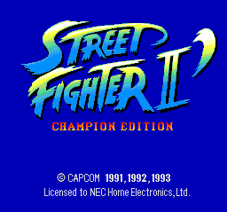
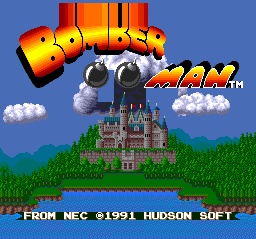
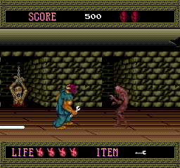

# TurboGrafx-16 / PC-Engine

This is a Rust emulator for the TurboGrafx-16 / PC-Engine console.
It is a hobby project to learn more about emulation and the inner workings of this console I wish I had as a kid.
It is by no means feature-complete, but it *does* run games like Street Fighter II and Bomberman, so it's not entirely useless either.

## Overview

The TurboGrafx-16 has a few main components that need to be emulated:

- The HuC6280 CPU, which is a modified 65C02 processor. I use my own [mos6502](https://github.com/mre/mos6502) for that.
- The Video Display Controller (VDC), which handles graphics rendering.
- The Video Color Encoder (VCE), which handles color output.
- The Audio Processing Unit (APU), which handles sound generation. (Not implemented yet)
- CD-ROM support (Not implemented yet)

There are still some glitches around grafic effects. Some games might not boot.
Also, I don't ship the ROMs for copyright reasons, so you'll have to provide your own.

## Screenshots

All of these were captured straight out of the emulator (see `examples/dump_frame.rs`):

| Street Fighter II' | Bomberman | Splatterhouse |
| --- | --- | --- |
|  |  |  |

(Castlevania doesn't run yet, because I don't have support for CD-ROM games yet.)

## But Why?

This started as a test-project for the `mos6502` CPU crate, but it turned into a full emulator.

Besides, the TurboGrafx-16 is a great console!
In comparison to other consoles of its time, it had a lot of advantages:

- It did NOT have a 16-bit CPU, but rather a Modified 8-bit CPU.
- It had a dual 16-bit graphics processor, which allowed for fancy graphics effects like parallax scrolling and sprite scaling. 
- Games were initially released on HuCard cartridges, but the platform later added CD-ROM support, which allowed for larger games and better audio quality. 

Overall, a great console that was ahead of its time, but unfortunately it was not as popular as other consoles like the Sega Genesis or Super Nintendo Entertainment System (SNES); mostly because of marketing and distribution issues.

## Hacking

I recommend spelunking around in the source code. It's not great right now and I need to do a makeover, specifically making it more Rustic and less imperative. If you'd like to help with that, feel free to submit a pull request.

## Crate Name

Thanks to [Paul Young](https://github.com/paulyoung) for donating the crate name `turbografx` to me. I appreciate it a lot.